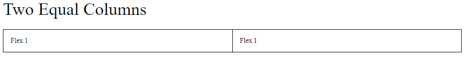

# Csslibrary

A Light Weight Minimal Css Framework.

---

## Getting Started

Download or Clone the Repo. After Downloading follow the further instructions

### Step 1

Just add a link to the css file in your <head>:

```html
<link href="css/style.css" type="text/css">
```

### Step 2

Include Jquery inside <head> tag

```html
<script src="js/jquery.min.js"></script>
```

### Step 3

Include JS File before closing <body> tag

```html
<script src="js/script.js"></script>
```

---

## Example for Two Equal Column

```html
<div class="flex">
    <div class="flex1">Flex 1</div>
    <div class="flex1">Flex 1</div>
</div>
```


---

## Documentation

Please go through the [documentation](https://jayasurya-seetharaman.github.io/cssframework/tables.html) for further details.

---

## Documentation Links

> Following are the available code samples

- [Tables](https://jayasurya-seetharaman.github.io/cssframework/tables.html)
- [Alerts](https://jayasurya-seetharaman.github.io/cssframework/alerts.html)
- [Buttons](https://jayasurya-seetharaman.github.io/cssframework/buttons.html)
- [Images](https://jayasurya-seetharaman.github.io/cssframework/images.html)
- [Dropdowns](https://jayasurya-seetharaman.github.io/cssframework/collapse.html)
- [Forms](https://jayasurya-seetharaman.github.io/cssframework/forms.html)
- [Pagination](https://jayasurya-seetharaman.github.io/cssframework/pagination.html)
- [Cards](https://jayasurya-seetharaman.github.io/cssframework/cards.html)
- [Modals](https://jayasurya-seetharaman.github.io/cssframework/modals.html)
- [Grids & Columns](https://jayasurya-seetharaman.github.io/cssframework/columns.html)
- [Utility Classes](https://jayasurya-seetharaman.github.io/cssframework/utility.html)